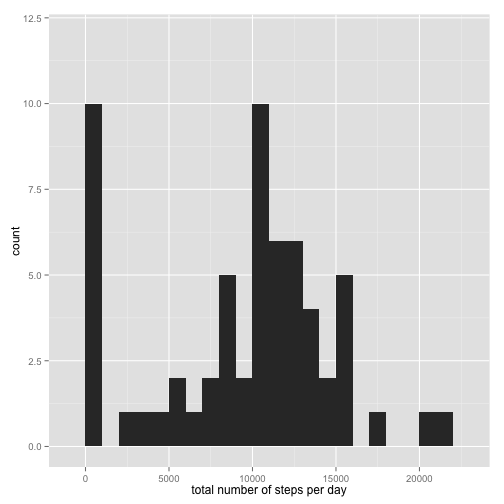
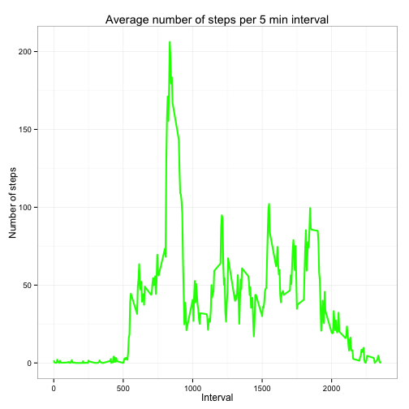
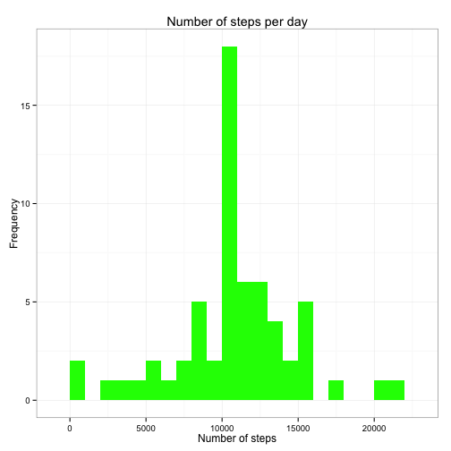

## Basic settings

```r
echo = TRUE # code is visible
```

## Loading and preprocessing the data

#### unzip and read data

```r
unzip("activity.zip")
data <- read.csv("activity.csv", colClasses = c("integer", "Date", "factor"))
data$month <- as.numeric(format(data$date, "%m"))
```


## What is mean total number of steps taken per day?
#### calculate the total number of steps per day

```r
steps_per_day <- aggregate(steps ~ date, data, sum)
colnames(steps_per_day) <- c("date","steps")
head(steps_per_day)
```

```
##         date steps
## 1 2012-10-02   126
## 2 2012-10-03 11352
## 3 2012-10-04 12116
## 4 2012-10-05 13294
## 5 2012-10-06 15420
## 6 2012-10-07 11015
```

#### load required library
#### make histogram of the number of steps per day

```r
library(ggplot2)
total.steps <- tapply(data$steps, data$date, FUN=sum, na.rm=TRUE)
qplot(total.steps, binwidth=1000,ylim=c(0, 12), xlab="total number of steps per day")
```

 

#### calculate and report the mean and median total number of steps per day


```r
mean(total.steps, na.rm=TRUE)
```

```
## [1] 9354.23
```

```r
median(total.steps, na.rm=TRUE)
```

```
## [1] 10395
```


## What is the average daily activity pattern?


#### Make a time series plotof the 5-minute interval (x-axis) and the average number of steps taken

```r
avgdata <- aggregate(data$steps, by = list(interval = data$interval), FUN=mean, na.rm=TRUE)

avgdata$interval <- as.integer(levels(avgdata$interval)[avgdata$interval])
colnames(avgdata) <- c("interval", "steps")

     

ggplot(avgdata, aes(x=interval, y=steps)) +   
        geom_line(color="green", size=1) +  
        labs(title="Average number of steps per 5 min interval", x="Interval", y="Number of steps") +  
        theme_bw()
```

 


#### Which 5-minute interval, on average across all the days in the dataset, contains the maximum number of steps?

```r
max_interval <- avgdata[which.max(  
        avgdata$steps),]

max_interval
```

```
##     interval    steps
## 272      835 206.1698
```
## Imputing missing values


#### total number of rows with NAs is:

```r
numberNA <- sum(is.na(data$steps))

numberNA
```

```
## [1] 2304
```


#### Devise a strategy for filling in all of the missing values in the dataset. The strategy does not need to be sophisticated. For example, you could use the mean/median for that day, or the mean for that 5-minute interval, etc.:

#### I used the mean to fill the missing values (NAs) and created a new dataset as follows:


```r
napos <- which(is.na(data$steps))

meanadd <- rep(mean(data$steps, na.rm=TRUE), times=length(napos))

data[napos, "steps"] <- meanadd

head(data)
```

```
##     steps       date interval month
## 1 37.3826 2012-10-01        0    10
## 2 37.3826 2012-10-01        5    10
## 3 37.3826 2012-10-01       10    10
## 4 37.3826 2012-10-01       15    10
## 5 37.3826 2012-10-01       20    10
## 6 37.3826 2012-10-01       25    10
```


#### Make a histogram of the total number of steps taken each day and Calculate and report the mean and median total number of steps taken per day. 


```r
stepsperday <- aggregate(steps ~ date, data, sum)
colnames(stepsperday) <- c("date","steps")

ggplot(stepsperday, aes(x = steps)) + 
       geom_histogram(fill = "green", binwidth = 1000) + 
        labs(title="Number of steps per day", 
             x = "Number of steps", y = "Frequency") + theme_bw() 
```

 
#### Mean and Median

```r
stepsmean   <- mean(stepsperday$steps, na.rm=TRUE)
stepsmedian <- median(stepsperday$steps, na.rm=TRUE)

stepsmean
```

```
## [1] 10766.19
```

```r
stepsmedian
```

```
## [1] 10766.19
```
#### Do these values differ from the estimates from the first part of the assignment? What is the impact of imputing missing data on the estimates of the total daily number of steps?

#### the values differ now. There is no difference between mean and median now. (perhaps there is an error in the first calculation as I would expect a shift towards the mean and not an increase over the median...have to think about it) 

## Are there differences in activity patterns between weekdays and weekends?


```r
head(data)
```

```
##     steps       date interval month
## 1 37.3826 2012-10-01        0    10
## 2 37.3826 2012-10-01        5    10
## 3 37.3826 2012-10-01       10    10
## 4 37.3826 2012-10-01       15    10
## 5 37.3826 2012-10-01       20    10
## 6 37.3826 2012-10-01       25    10
```

```r
data$weekdays <- factor(format(data$date, "%A"))
levels(data$weekdays)
```

```
## [1] "Dienstag"   "Donnerstag" "Freitag"    "Mittwoch"   "Montag"    
## [6] "Samstag"    "Sonntag"
```

```r
levels(data$weekdays) <- list(weekday = c("Monday", "Tuesday",
                                             "Wednesday", 
                                             "Thursday", "Friday"),
                                 weekend = c("Saturday", "Sunday"))
levels(data$weekdays)
```

```
## [1] "weekday" "weekend"
```

```r
head(data)
```

```
##     steps       date interval month weekdays
## 1 37.3826 2012-10-01        0    10     <NA>
## 2 37.3826 2012-10-01        5    10     <NA>
## 3 37.3826 2012-10-01       10    10     <NA>
## 4 37.3826 2012-10-01       15    10     <NA>
## 5 37.3826 2012-10-01       20    10     <NA>
## 6 37.3826 2012-10-01       25    10     <NA>
```
## unfortunatly no more time to finish :-(
